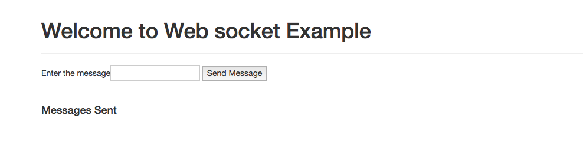
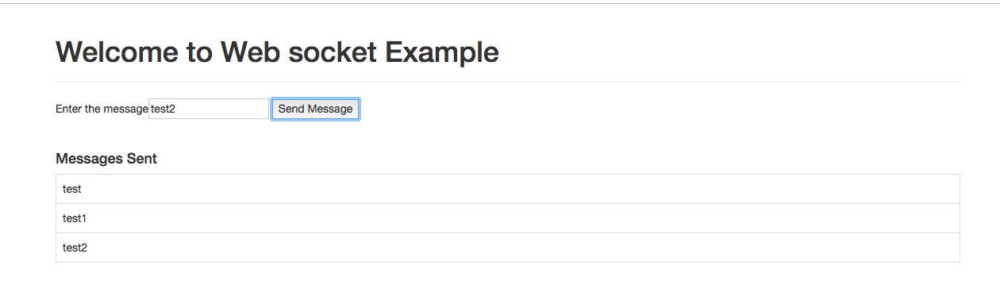

# WEBSOCKET SIMPTEMPLATE

### A Simple Spring Boot Application using websockets,Stomp Js.

<p>

This application uses SimpTemplate to send the messages to the websocket.


To do this : 

In the controller class, 

```
@Autowired
private SimpMessagingTemplate template;

template.convertAndSend(destination,payload);

```


</p>

### How to run the application ?

* Run using maven command

```
$ ./mvnw clean install

$ ./mvnw spring-boot:run

```

### How to test the application ?

 * Navigate to http://localhost:9092

 

 * Enter message and click on send message

 

 * Access ```http://localhost:9092/welcome.html``` to test @RequestParam mapping.

 


